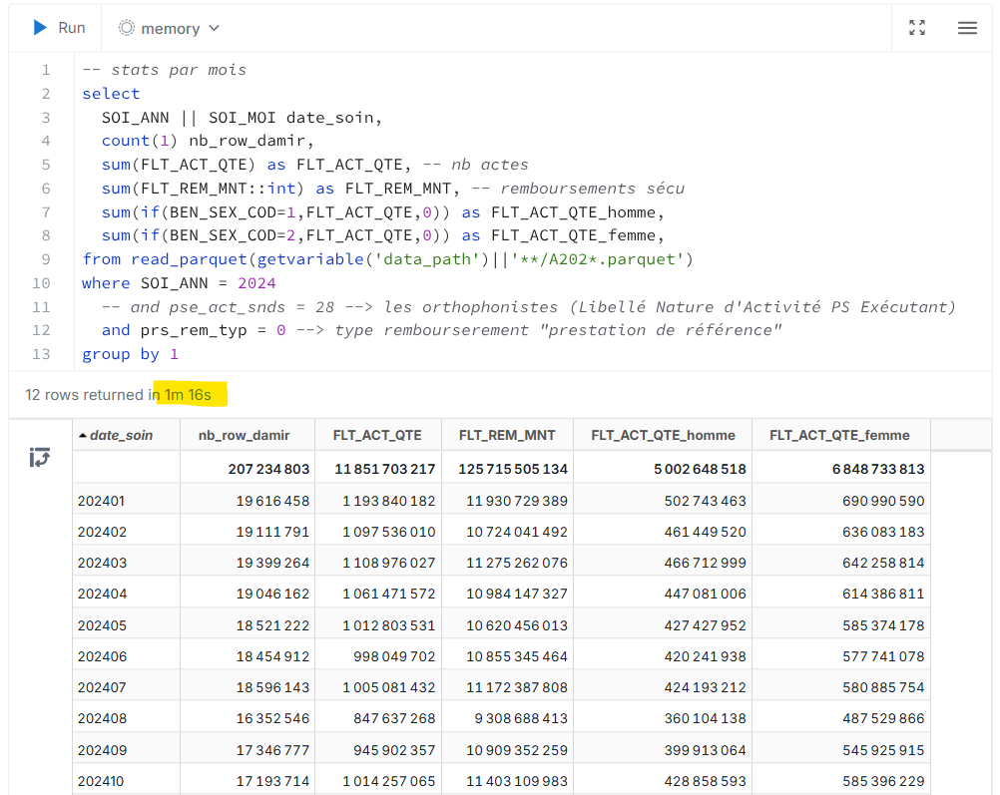

# Projet d'exploration des données DAMIR

> [Open Damir](https://www.assurance-maladie.ameli.fr/etudes-et-donnees/open-damir-depenses-sante-interregimes) : cette base de données mensuelle présente les remboursements de soins effectués par l'ensemble des régimes d'assurance maladie (base complète) en France depuis 2009.

## Ce projet

Un pêle mêle de scripts sql (DuckDB 🦆) & pyton
pour
- télécharger automatiquement les fichiers damir
- parser les données damir en .parquet
- qq explorations sur le pouce


### Notes sur DuckDB 🦆🚀

[DuckDB](https://duckdb.org/) est une BDD OLAP (analytique) super rapide, légère (25Mo) & opensource

En plus de leur super site internet,<br> voici un [📹 webinaire "Quels usages pour DuckDB"](https://www.youtube.com/watch?v=pzTVUm1ifA0) avec Stéphane Heckel & moi-même sur [Datanosco](http://datanosco.com/)

## Revue de litterature

La **page de téléchargement** des données [open damir](https://www.assurance-maladie.ameli.fr/etudes-et-donnees/open-damir-depenses-sante-interregimes) & sa documentation

le [répot github](https://github.com/SGMAP-AGD/DAMIR) du [**hackathon** d'etalab](https://www.etalab.gouv.fr/retour-sur-le-premier-hackathon-donnees-de-sante/) en 2015

des **mémoires de recherche**
- de [2018 - Lyon](https://journeesiard2019.institutdesactuaires.com/docs/mem/7b49073812c2d4775d615975e6823098.pdf) - M. MEKONTSO FOTSING
- de [2022 - Paris Daufine](https://www.institutdesactuaires.com/docs/mem/6c8b6c92b28edf63fd916809f8e459e1.pdf) - Mme. BOYER

> Mme BOYER a concentré son analyse sur les années 2018 & 2019 de la base Open Damir représentant 806 millions de lignes. Elle a réalisé une réduction de dimension afin d'obtenir un jeu de données plus réduit de 10 millions de lignes (cf. Figure 1 page 7)
> 

## Documentation

> Au total, chaque ligne de prestation est décrite par 55 variables. - **doc Open Damir**

💡 [Excel](https://www.assurance-maladie.ameli.fr/content/descriptif-des-variables-de-la-serie-open-damir-base-complete) descriptif des variables Open Damir
<br> 👉 Copié & exporté dans le dossier [dim_damir_colonnes](./dim_damir_colonnes/)

### Axes d'analyse

* **Période de traitement** & rembourserment (année / mois)
* **Prestation** : date de soin, type d'actes ...
* Organisme de prise en charge
* **Bénéficiaire** du soin : sexe, age, région...
* **Exécutant** : région, catégorie
* **Prescripteur** : région, catégorie
* Périmètre CMU-C

### Indicateurs agrégés (volumes & montants)

>   <br>-> page 43 mémoire Mme Boyer

#### Volumes

| Indicateur  | Définition   | Note |
| :----- | :------ | :------ |
| `ACT_QTE` | Quantité | Nb d'actes réalisés |
| `ACT_COG` | Coefficient Global | `quantité x coefficient tarifé de l'acte` |
| `ACT_NBR` | Dénombrement | Parfois incomplet, privilégier la quantité |

#### Montants

| Indicateur  | Définition   | Note |
| :----- | :------ | :------ |
| `PAI_MNT` | Montant de la Dépense | Frais réels de la prestation de santé |
| `REM_BSE` | Base de Remboursement | Montant défini par la *sécu* |
| `REM_MNT` | Montant Versé/Remboursé par la *sécu* | `REM_BSE * ACT_QTE * taux de remboursement` |
| `DEP_MNT` | Montant du Dépassement | `PAI_MNT - REM_MNT` - les remboursements de la *sécu* uniquement |

#### **Note** : indicateurs préfitrés ou non

cf. [Figure 2.2 - Mémoire BOYER](./docs/memoire_2022_indicateurs.png)

* `PRS_` : non préfiltré 🎯 étudier les régimes spéciaux
* `FLT_` : préfiltré (sauf `REM_BSE`) 🎯 étudier le régime obligatoire

## 1ères explorations avec DuckDB 🦆🚀

### Intérêt du `.parquet`

**Qq chiffres** sur le mois de janvier 2024

|    |            |
| :-- |:-- |
|lignes| 38 millions |
|`.csv.gz`| 1Go |
|`.csv`| 6.5Go |
|`.parquet`| 1.8Go |

💡 Un `.csv` doit être lu en entier pour analyser un échantillion de colonnes. A contrario, le `.parquet` range & compresse les données par colonnes. Lors d'une analyse, on ira lire uniquement les données des colonnes voulues.

```sql
-- transformer un .csv.gz en .parquet ⏱ ~1m30
copy ( from read_csv('input/A202401.csv.gz') )
  to 'data/A202401.parquet';
```

```sql
-- ⏱ ~1m30 -> stats par colonne min/max/count/...
summarize from 'data/A202401.parquet';
```


### 1ère aggrégation par date de soin

en ⏱ 1 min 16s : aggrégation par mois des soins de 2024 pour afficher le nb d'actes & le montant des remboursements de la sécurité sociale


