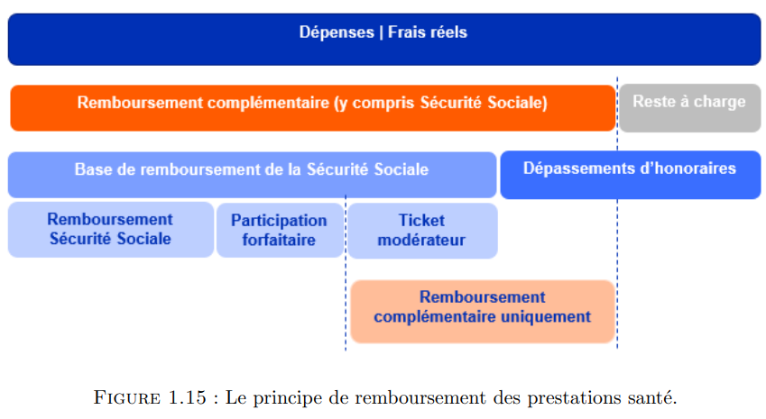
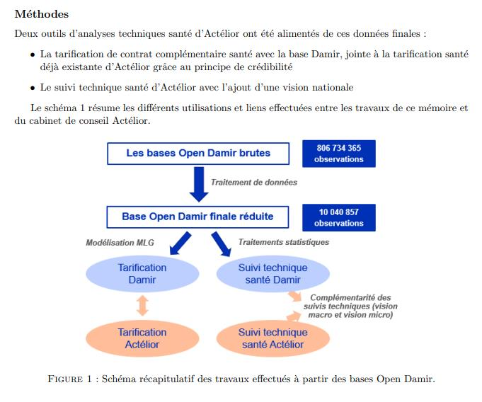
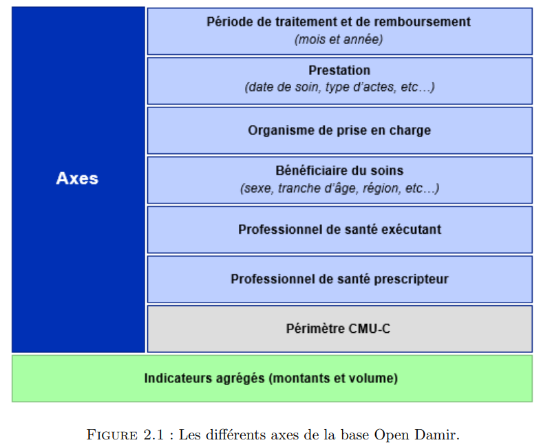
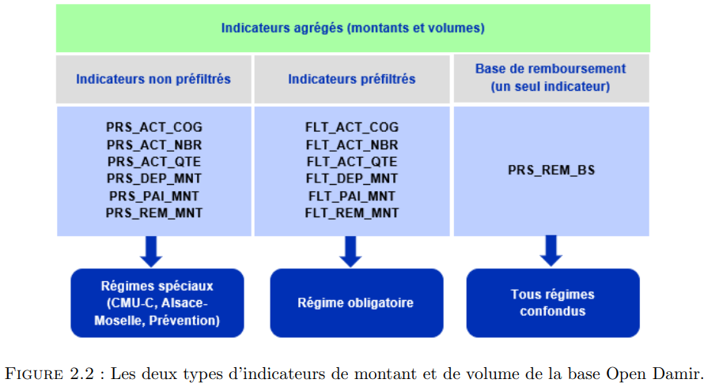
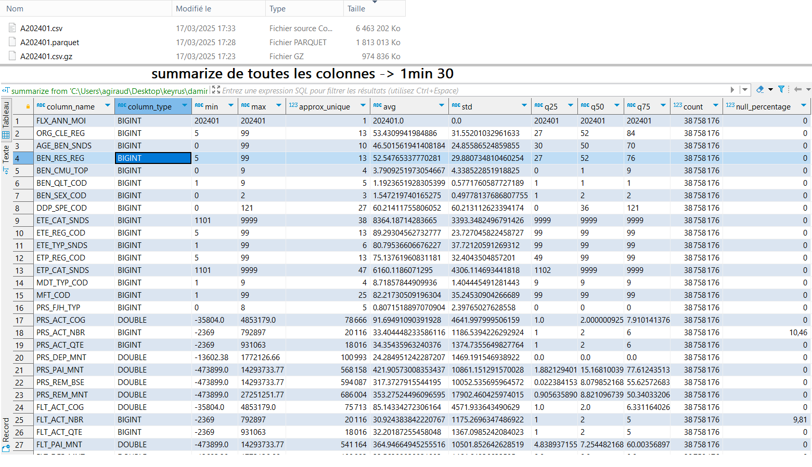

# Projet d'exploration des données DAMIR

> [Open Damir](https://www.assurance-maladie.ameli.fr/etudes-et-donnees/open-damir-depenses-sante-interregimes) : cette base de données mensuelle présente les remboursements de soins effectués par l'ensemble des régimes d'assurance maladie (base complète).

## Ce projet

Un pêle mêle de scripts sql (DuckDB 🦆) & pyton
pour
- télécharger automatiquement les fichiers damir
- parser les données damir en .parquet
- qq explorations sur le pouce


### Notes sur DuckDB 🦆🚀

[DuckDB](https://duckdb.org/) est une BDD OLAP (analytique) super rapide, légère (25Mo) & opensource

En plus de leur super site internet,<br> voici un [📹 webinaire "Quels usages pour DuckDB"](https://www.youtube.com/watch?v=pzTVUm1ifA0) avec Stéphane Heckel & moi-même sur [Datanosco](http://datanosco.com/)

## Revue de litterature

La **page de téléchargement** des données [open damir](https://www.assurance-maladie.ameli.fr/etudes-et-donnees/open-damir-depenses-sante-interregimes) & sa documentation

le [répot github](https://github.com/SGMAP-AGD/DAMIR) du [**hackathon** d'etalab](https://www.etalab.gouv.fr/retour-sur-le-premier-hackathon-donnees-de-sante/) en 2015

des **mémoires de recherche**
- de [2018 - Lyon](https://journeesiard2019.institutdesactuaires.com/docs/mem/7b49073812c2d4775d615975e6823098.pdf) - M. MEKONTSO FOTSING
- de [2022 - Paris Daufine](https://www.institutdesactuaires.com/docs/mem/6c8b6c92b28edf63fd916809f8e459e1.pdf) - Mme. BOYER

## Figures récap - *mémoire Mme Boyer*

>   <br>-> page 43

>  <br>-> page 07

>  <br>-> page 51<br>
> Pour ces six axes d’analyses, de nombreuses variables de type qualitative sont disponibles. Elles donnent des précisions sur la nature de la prestation, le type de remboursement, le lieu de résidence et l’âge du bénéficiaire, mais aussi le type de spécialité du professionnel de santé exécutant et prescripteur, et bien d’autres encore. Le nom de chaque variable ainsi que leur description sont donnés dans le tableau A.7 disponible en annexe.

>  <br>-> page 52

> D’autres variables quantitatives viennent s’ajouter à ces six axes. Ce sont les indicateurs de montant et de volume des remboursements des prestations en santé
> * [REM_BSE] la **base de remboursement** : il s’agit d’un montant défini par la Sécurité Sociale
> * [PAI_MNT] le montant de **la dépense** : ils correspondent aux frais réels, ce que coûte la prestation santé
> * [DEP_MNT] le montant du **dépassement** : après prise en charge d’une partie des frais réels par la Sécurité
Sociale, le dépassement correspond à la différence des frais réels et du montant remboursé partiellement ou intégralement. La base Open Damir contient uniquement les informations sur les
remboursement de la Sécurité Sociale. Aucune information sur les remboursements des organismes complémentaires n’est indiqué.
> * [REM_MNT] Le montant du **remboursement obligatoire** : il correspond au montant remboursé par la Sécurité
Sociale (c.f. figure 1.15)

> Concernant les indicateurs de volumes de la base Open Damir, il existe :
> * [ACT_QTE] la quantité d’actes,
> * [ACT_NBR] le dénombrement d’actes,
> * [ACT_COG] le coefficient global.

## 1ères explorations avec DuckDB 🦆🚀

**Qq chiffres** sur le mois de janvier 2024

|    |            |
| :-- |:-- |
|lignes| 38 millions |
|`.csv.gz`| 1Go |
|`.csv`| 6.5Go |
|`.parquet`| 1.8Go |

Voici **qq commandes pratiques**

```sql
-- transformer un .csv.gz en .parquet ⏱ ~1m30
copy ( from read_csv('input/A202401.csv.gz') )
  to 'data/A202401.parquet';

-- ⏱ ~1m30
summarize from 'data/A202401.parquet';
```

